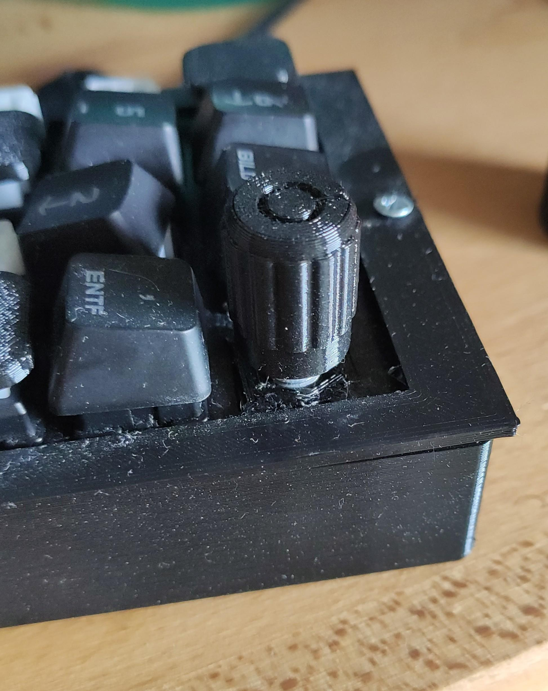

# EC11 Knob

Designed for the Encoders with a cutout in the middle and to be taller then the one I bought.
The big big version is for encoders that are not possible to move otherwise.

## default specs
- total height: 2cm
- cutout height: 7mm

## pictures

