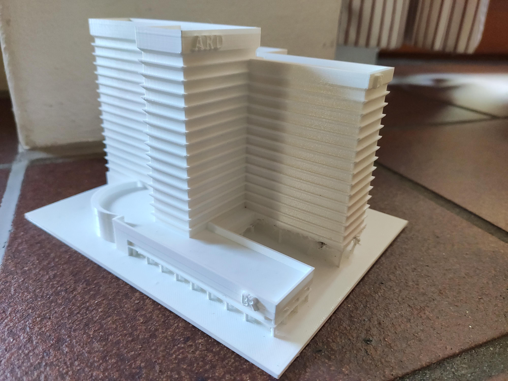
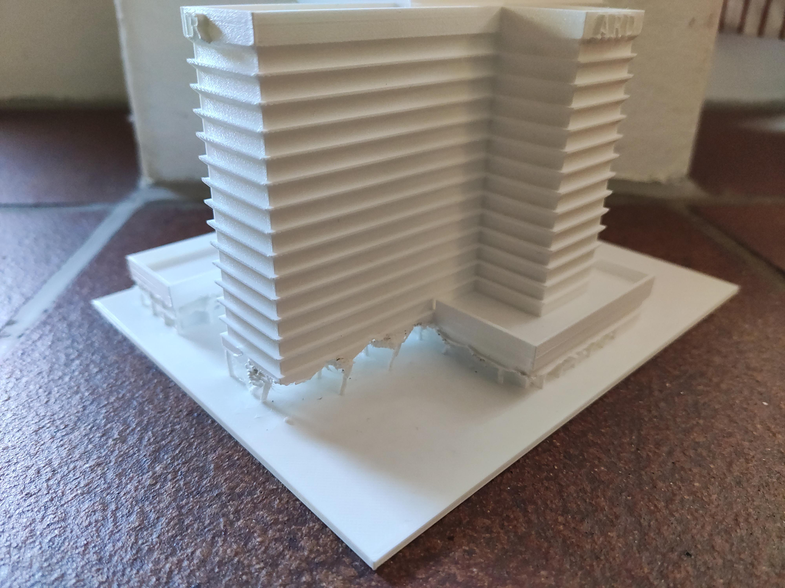

# Rundfunk haus 

This is a try at copying a house using only pictures. The 3D print is about 17cm high and took about 16 hours to print without supports. Everything is somewhat off...

## pictures

