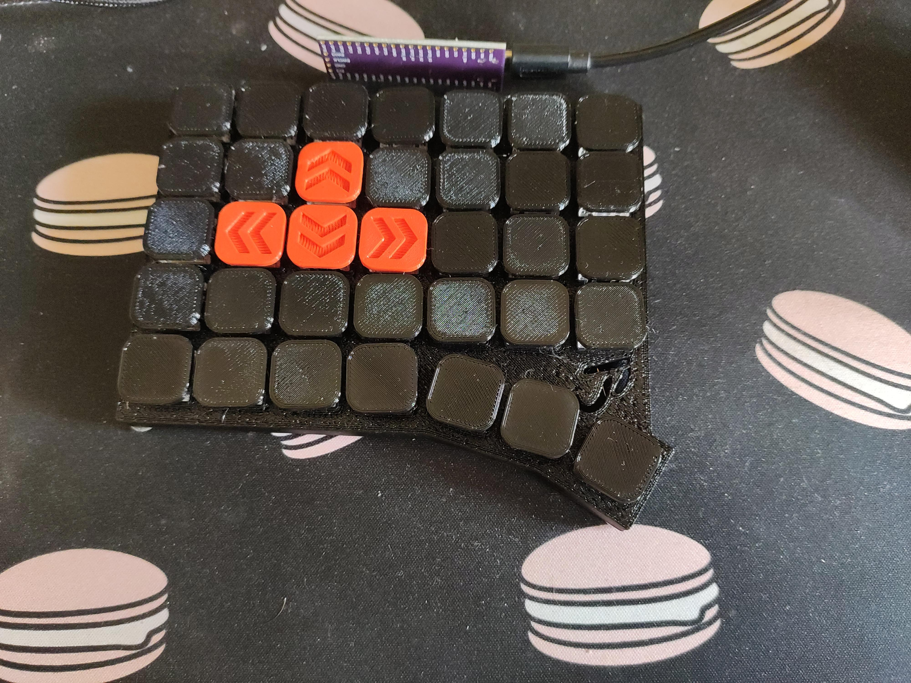
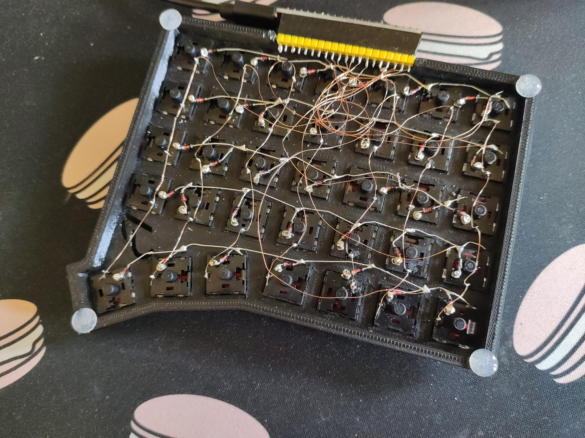

# Gaming Half Keyboard

A handwired, ortho keyboard for the left hand, designed to be as slim as possible using low profile switches.

This keyboard uses qmk/vial for the firmware and a pi pico (or similar RP2040 boards) for its hardware. The files can be found in the qmk_vial folder in this directory.

## specs
- height with rubber feet and my low profile keycaps: 2cm

## pictures

