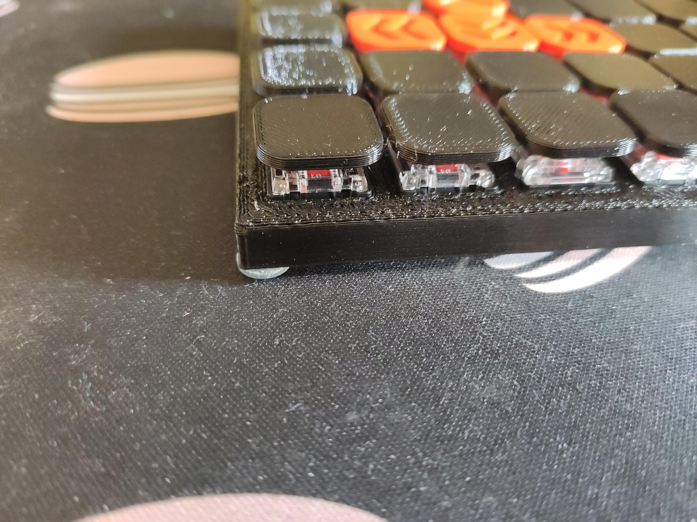

# Gaming Half Keyboard

A handwired, ortho keyboard for the left hand, designed to be as slim as possible using low profile switches.

## specs
- height with rubber feet and my low profile keycaps: 2cm

## pictures

