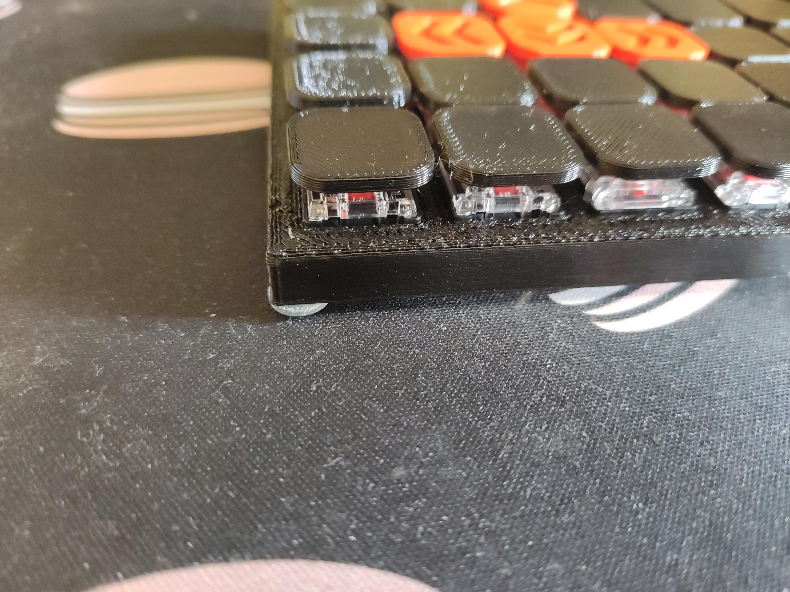
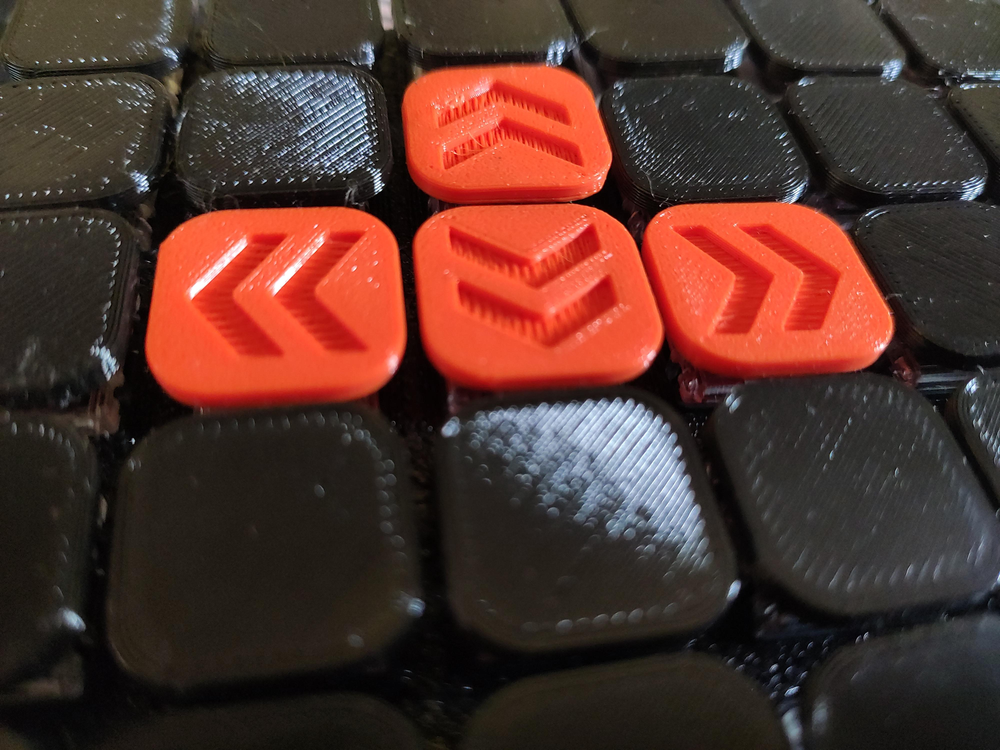

# Keycaps

Collection of keycaps:
- low profile: 2mm thick. 1mm is possible but breaks easily.
- Logitech Romer G low profile: same as above but uses the Logitech stem. It doesn't fit perfectly but it fits better then the original keycap I removed once.
- standard keycap: keycap with a cuvature, designed using: https://external-preview.redd.it/6jci5r0CJbnD0Lrs4XiSNsOU3O9OJQxm0Own9GD7dRE.jpg?auto=webp&s=fca0b02cecb6f83ee1d0361de98629d67e30e1ed (https://www.reddit.com/r/MechanicalKeyboards/comments/51wta9/keycap_dimensions)
> not tested!
- XDA: WIP
> not tested!

## pictures

