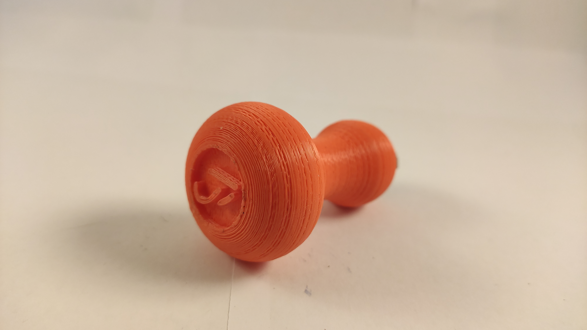
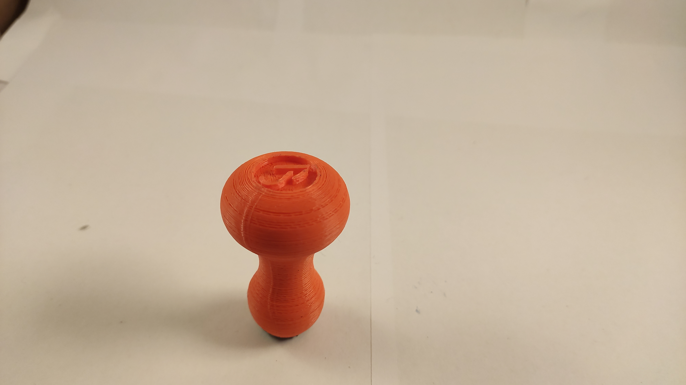

# logo stamp

This is a stamp for my logo using kork for the actual stamp.
There is also a clean stl in this repo if you like the stamp design.

The bottom incut is only for reference when glueing the kork/rubber on.

## pictures

