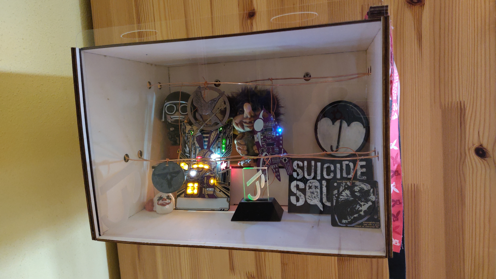

# Showcase Box

This is a showcase box to showcase different types of small models, especially ones with lights.
This box is created by cutting multiple wooden and acrylic sheets using a laser.

I used code from this [workshop](https://github.com/Windfisch/eh21-b3d-workshop), built ontop of the python package build123d to Design the 3D box.
As this project did not work for me, I edited those files and mutilated the structure.
I also created the shell.nix file to setup everything necessary it is still required to setup some things manually. Good luck trying to understand the commented snippets...

It is both very specific for my needs and not very nice.
But it works.

## pictures

