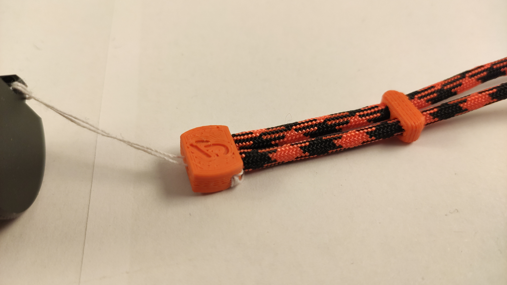
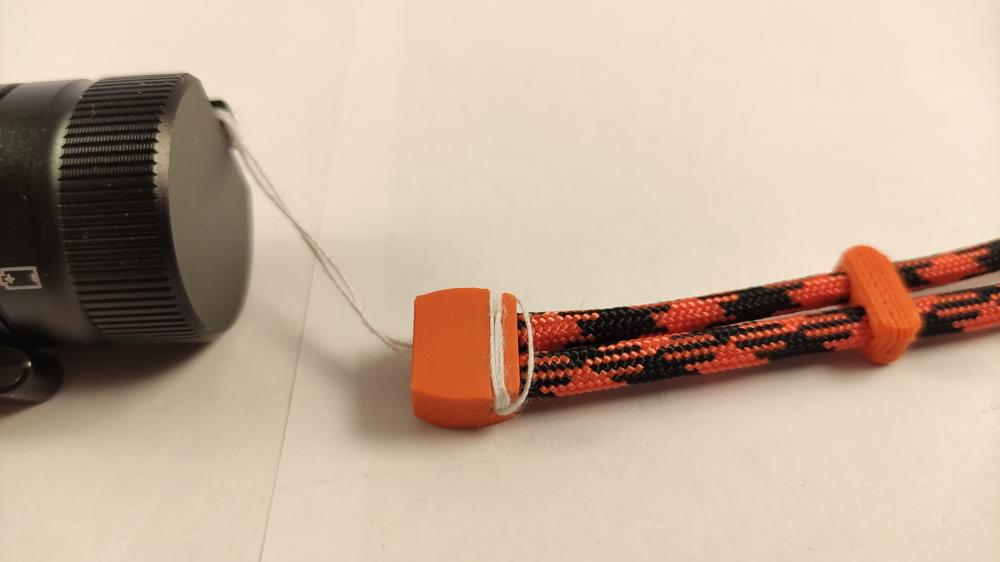

# wrist strap

This is a simple wrist strap using 3D printed parts as well as some Paracord 550 (4mm diameter).

I am using a needle to sew the powercord together:
- 2 times through the side wholes
- go through the closest cord on the big wholes and try to find the small whole
- then go back through the other small whole and do another 2 times through the side wholes
- try to cut it so that the ending hides inside so that it will look better then in the pictures
If you can't understand my writing, look at the pictures. You'll figure it out.

## pictures

